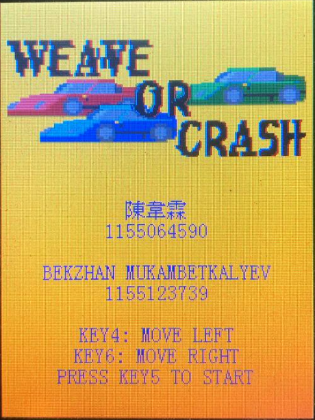
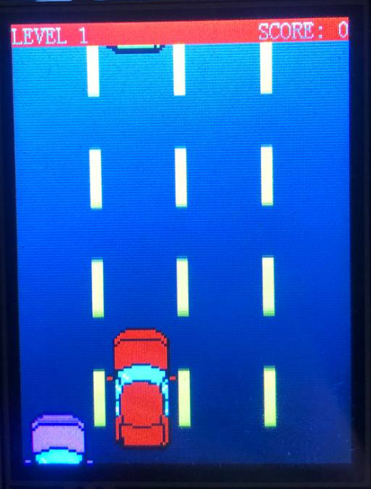
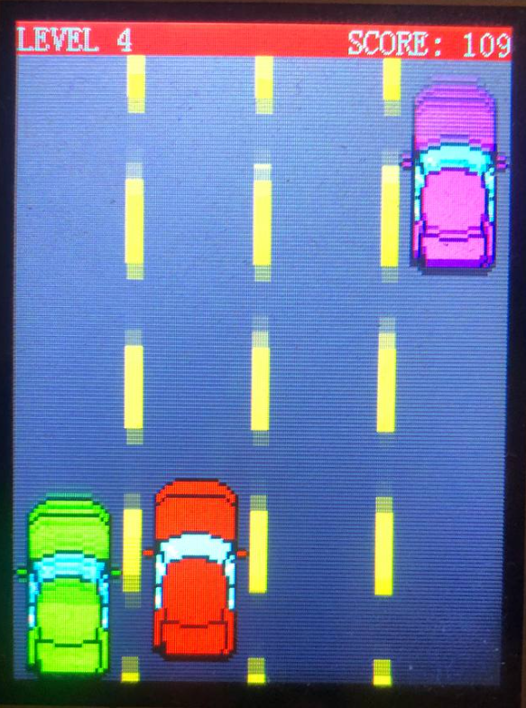
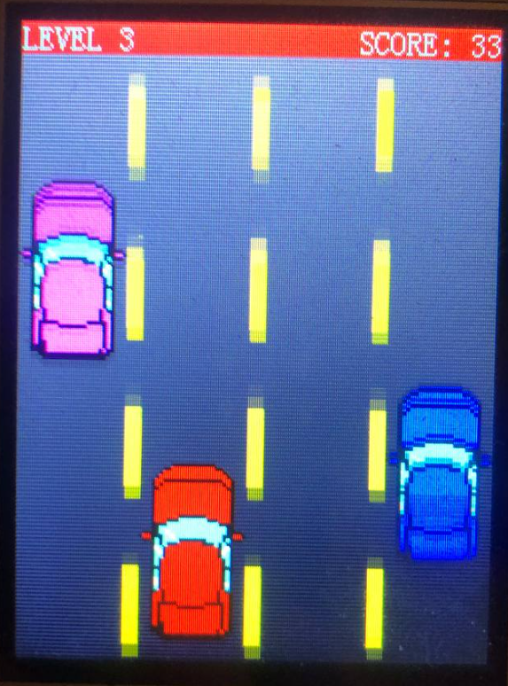
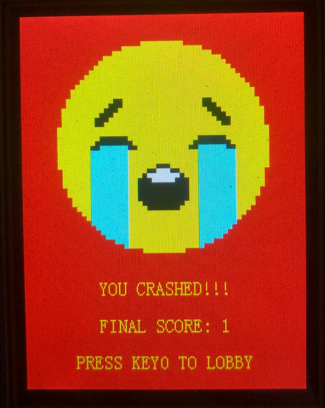
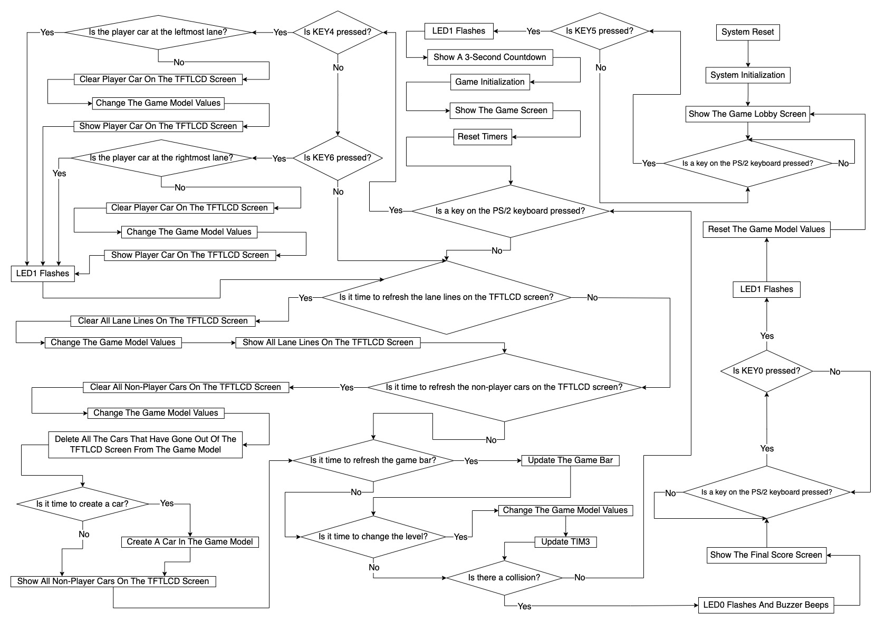

# IERG3810 Microcontrollers and Embedded Systems Project Report (Spring 2022)

Course project for IERG3810 Microcontrollers and Embedded Systems.

## Objectives
* Design and Implement a game.
* Show CUIDs and Names on the start page.
* Demonstrate programming skills.
* Use hardware and technology that we learned at the IERG3810 course.
* Make overall: Good performance, reliable (self recovering) project with limited resourses.

## Background
### Game Idea
In our project, which we called Weave Or Crash, we implemented a simple game. 
Once user presses the reset button. We welcome it with the start page, that contains game logo, information on user controls and our names and CUIDs.
<p align="center">

   <br><span>Pic1. Start page.</span> </p>

The idea of our game is quite simple, you control a car that is driving along the highway against randomly generated traffic and maneuver along the lanes so as not to get into an accident. Once you collide with other cars, you lost. We also added 3 second countdown before the game starts to allow player focus and prepare for the game session.

<p align="center">
   
<br>
<span> Pics 2,3,4. Game in progress.</span>
</p>  

We allowed players to move either to the left or to the right in order to maneuver between cars in the traffic lanes. Over time, the speed of the car increases, as do the points that the player can earn by overtaking other cars. Game seems to be very simple at first glance, but once you reach a high speed that is not longer true.

Once player hits another car, the game is over for the player. So we show the game over screen together with the players score.  

<p align="center">
  <br>  
<span> Pic5. Game Over page. </span>
</p>

#### Game Controls  
*PS2 KEY4*: Move to the left, if the car is not in the leftmost lane.  
*PS2 KEY6*: Move to the right, if the car is not in the rightmost lane.  
*PS2 KEY5*: To start the game.  
*PS2 KEY0*: To return to lobby after crash.  

#### Hardware used:  

**KEY**: To Reset and start the game.  
**PS2 Keyboard**: To get player inputs.  
**LEDs** : Used LEDs to indicate player inputs through PS2 keyboard as well as Indicate the player collision with other cars.  
**TFTLCD** : Used as the main display for gaming graphical interface.    
**Timer** : Used SYSTick to control the speed, interval between object generation, overall difficulty of the game.  
**Buzzer**: To indicate player collision by sound.  

## Program flow  
   
  

## Design choice MV
### Model View Design
#### Model
In the game model, there are three main elements: the background lanes, the player car, and the other cars, score bar.  

**Model Design**  (Cars)  
The car struct has three key parameters:  
```C
typedef struct car {
	int lane; // Lane
	int y; // Position
	u16 color; // Color
} Car;
```

**Player car**  
```C
void PlayerCar_init(void); //Init player car on lane 2, bottom boundary, with color red.
```
Lane position : Lane position can be changed by the player inputs.  
Y position : Y position stays at the bottom boundary for the player car.  
Color : Color of the player car is red.  

**Non-player cars**  
```C
Car car_array[car_array_size];
u16 other_cars_color[4] = {green, blue, yellow, magenta}; //Possible colors for non player cars

void Car_init(void); //Populate car_array with cars.
void CreateCar(void); //Randomize lanes and colors for the non-player cars.
void DestroyCar(void); //Once non-player car reaches the bottom of the screen, destroy it.
void ShowAllCars(void); //Connector to the view component for the car.
void ClearAllCars(void); //Connector to the view component for the car.
void CarsMove(void); // Move non-player cars down by Y-axis based on the current difficulty.

```
Lane position : Constant for the non player car and assigned during the CreateCar(void) method. Describes in which lane car will appear during the game.  
Y position : Y position starts at top but decreases according to time. Speed of decrease depends on a `difficulty`  
Color : Color of the car are chosen randomly during CreateCar(void) method.  

**Model Design**  (Lane Lines)  
```C
typedef struct laneline {
	int exist; // Existence on the screen
	int y; // Y position
	u16 color; // Color
} LaneLine;

LaneLine laneline_array[laneline_array_size];

void LaneLine_init(void); //Initialize lane lines.
void ShowAllLaneLines(void); // Show lane lines between the lanes.
void ClearAllLaneLines(void); //Clear all lane lines.
void LaneLinesMove(void); // Move lane lines, to simulate that cars are moving due to relative perspective
void DrawRoad(void); // Draw background road, lane lines, cars.
```
Exist :  Indicates existence of a lane line on the screen.  
Y position : Y position changes overtime, to simulate that cars are moving due to relative perspective.  
Color : Color of the line lane are always same.  

**Model Design**  (Score bar)  
```C
void DrawBar(void); // Connector to the view component. Send current level, score to the view.
void UpdateBar(void); // Connector to the view component. Send updated level, score to the view.
```

**Other model logic components:**  
```C
void DetectCollision(void); // Detect collision of cars.
void UpdateSpawnFrequency(void); // Update the frequency of spawning new cars. 
void IncreaseDifficulty(void); // difficulty += 1, Call UpdateSpawnFrequency().
void AddScore(void); // Add score. Based on the formula: score += current difficulty
void Countdown3s(void); // Uses timer, to countdown from 3 before the game starts. Connector to view.
```

#### View  
View methods  
```C
// LAB 3 Supplement functions used in our project.
void IERG3810_TFTLCD_DrawDot(u16 x, u16 y, u16 color); // Supplement function for drawing objects.
void IERG3810_TFTLCD_FillRectangle(u16 color, u16 start_x, u16 length_x, u16 start_y, u16 length_y); // Supplement function for drawing objects.
void IERG3810_TFTLCD_SevenSegment(u16 color, u16 start_x, u16 start_y, u8 digit); //Suplement function for drawing digits.
void IERG3810_TFTLCD_DrawDigit(u16 color, u16 start_x, u16 start_y, int i); // Draw digits. used in countdown method.
void IERG3810_TFTLCD_ShowChar(u16 x, u16 y, u8 ascii, u16 color, u16 bgcolor); // Draw Characters from char[][] stored in FONT.H
void IERG3810_TFTLCD_ShowChinChar(u16 x, u16 y, int num, u16 color, u16 bgcolor); // Draw Chinese Characters from char[][] stored in CFONT.H
void IERG3810_TFTLCD_ShowCharOverlay(u16 x, u16 y, u8 ascii, u16 color); // Draw overlay for Characters from char[][] stored in FONT.H
void IERG3810_TFTLCD_ShowChinCharOverlay(u16 x, u16 y, int num, u16 color); // Draw Overlay for Chinese Characters from char[][] stored in CFONT.H
```

```C
void IERG3810_TFTLCD_FillRectangleConversion(u16 color, int start_x, u16 length_x, int start_y, u16 length_y); // Fill Rectangle method for the specified game screen
void IERG3810_TFTLCD_ShowCar(int x, int y, u16 color); // Draw car pixel by pixel
void IERG3810_TFTLCD_ShowCarOnLane(int lane, int y, u16 color); // Draw car on lane
void IERG3810_TFTLCD_ClearCarOnLane(int lane, int y, u16 bgcolor); // "Destroy cars on lane"
void IERG3810_TFTLCD_ShowLaneLine(int laneline, int y, u16 color); // Draw lane lines.
void IERG3810_TFTLCD_ClearLaneLine(int laneline, int y, u16 bgcolor); // Clear lane lines.
void IERG3810_TFTLCD_DrawLogo(u16 x, u16 y); // Draw logo using char[] stored in Logo.H
void IERG3810_TFTLCD_ShowStartScreen(void); // Show names, cuids, game controls and logo on the start page
void IERG3810_TFTLCD_ShowLoudlyCryingFace(u16 x, u16 y, u16 scale); // Draw loudly crying face emoji
u16 IERG3810_DetermineNumberOfDigits(u16 x); // See how many digit space number requires.
void IERG3810_TFTLCD_ShowFinalScore(u16 score); // Show game over page. Including crying face, and final score
void IERG3810_TFTLCD_ShowLevel(u16 difficulty); // Convert u16 digit into the screen dificulty and show it.
void IERG3810_TFTLCD_ShowScore(u16 score); // Convert u16 digit into the screen score and show it.

```

##### View Design Pages  
The view of this game includes three pages:   
* Start screen,   
* Game screen,   
* Game-over screen.  

###### Start screen:  
* Game Logo : Weave or crash logo.  
* Names and CUIDs : Based on the ShowChar() and ShowChiChar() function we used in Lab3, we can draw our names and CUIDs on the Start Screen.  
* User controls: Based on the ShowChar() and ShowChiChar() function we used in Lab3, we can draw instructions on player controls during the game on the Start Screen.  

Note: For the Game Logo we used the **Image2cpp** website to transform picture into c array file containing hex values for the color in a specific pixel. The output is stored in c file like FONT.H can be included in the header.  

###### Game screen:  
* Player Car: Using our TFTLCD library to draw player car.  
* Other Cars: Using our TFTLCD library to draw other car.  
* Lane Lines: Using our TFTLCD library to draw lane lines.   
* Score bar: Using our TFTLCD library to draw score bar.  

###### Game-over screen:  
* Crying face : We use IERG3810_TFTLCD_ShowLoudlyCryingFace method to draw crying face pixel by pixel.  
* Score and Restart info : Using FONT.H header we display player's final score and instruction how to restart game.  

## Implementation
 ==TODO== Timers use described here
## Challenges
 ==TODO==
## Summary
 ==TODO==


